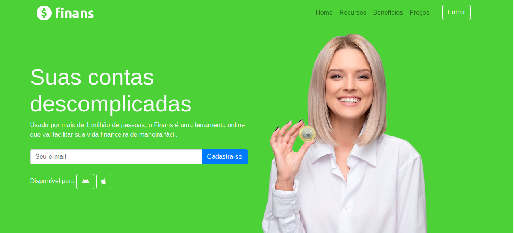

# Finans

  

  
      
          
          
          

    <a href="#speech_balloon-sobre">Sobre</a>&nbsp;&nbsp;&nbsp;|&nbsp;&nbsp;&nbsp;
    <a href="#hammer_and_wrench-tecnologias">Tecnologias</a>&nbsp;&nbsp;&nbsp;|&nbsp;&nbsp;&nbsp;
    <a href="#gear-requisitos">Requisitos</a>&nbsp;&nbsp;&nbsp;|&nbsp;&nbsp;&nbsp;
    <a href="#scroll-licença">Licença</a>&nbsp;&nbsp;&nbsp;&nbsp;&nbsp;&nbsp;    

### :speech_balloon: Sobre

Projeto de uma página web responsiva utilizando o bootstrap para estilização, usando o grid e outras abordagens de estilos. Veja [aqui](https://wevdiaz.github.io/Finans/);

### :hammer_and_wrench: Tecnologias

- HTML
- Bootstrap
- Git
- Responsividade

### :gear: Requisitos

Para rodar a página

- Baixe para sua máquina
- Você pode abrir em qualquer navegador o arquivo index.html

### :scroll: Licença

Esse projeto está sob a licença [MIT](https://github.com/wevdiaz/Finans/blob/main/LICENSE)

Projeto desenvolvido no curso de desenvolvimento web do instrutor 👨‍🏫 [Jamilton Damasceno](https://www.linkedin.com/in/jamiltondamasceno).
